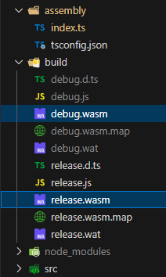
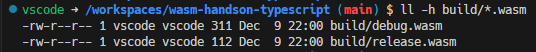
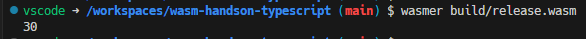
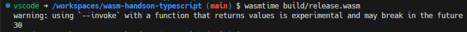
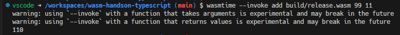
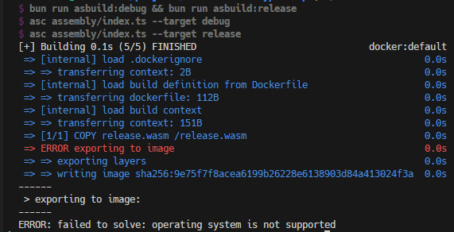
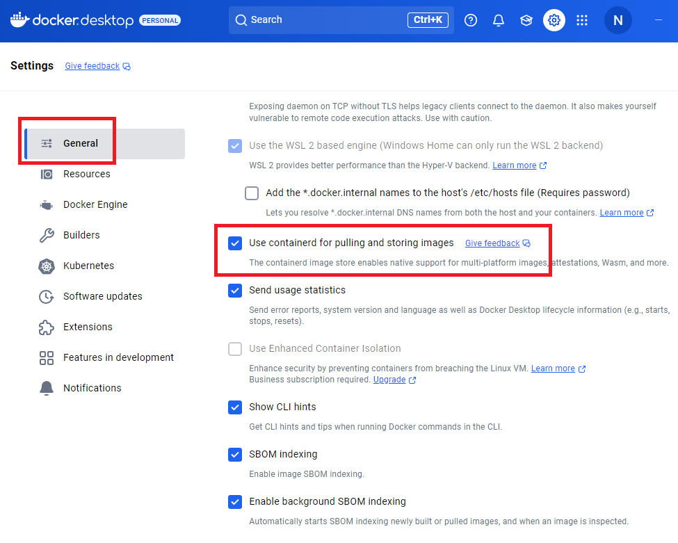
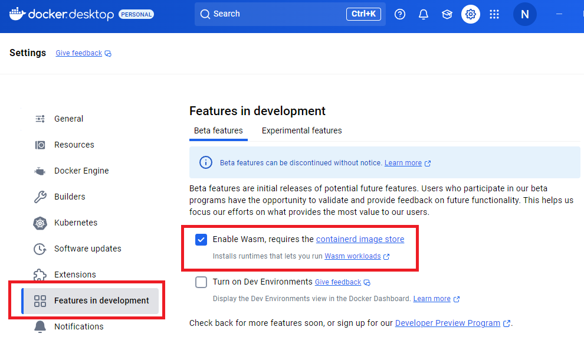
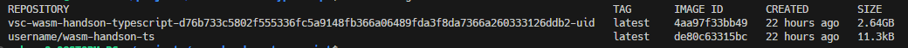

# Typescript -> wasm の変換方法を調べる

## [Porffor](https://porffor.dev/)
- [Publickey | JavaScript/TypeScriptからWebAssemblyやネイティブバイナリを生成するコンパイラ「Porffor」の開発が加速へ、開発者がフルタイムで取り組み](https://www.publickey1.jp/blog/24/javascripttypescriptwebassemblyporffor.html)
- 現在はpre-alpha状態で2025年に利用可能になる模様なので様子見

## [AssemblyScript](https://www.assemblyscript.org/getting-started.html#setting-up-a-new-project)
- [Zenn | TypeScriptでWebAssemblyに入門する](https://zenn.dev/is_ryo/articles/d75db3ad37bea0#assemblyscript)
- 現状だとこれが選択肢になりそうな感じ

# setup
1. devcontainer環境を開く
2. 依存関係をインストール

```sh
bun install
```

# How to AssemblyScript
## パッケージのインストール
```sh
bun add -d assemblyscript
```

`assembly/`配下に以下のような`index.ts`が生成される。

```ts:assembly/index.ts
// The entry file of your WebAssembly module.

export function add(a: i32, b: i32): i32 {
	return a + b;
}
```

`package.json`にはAssemblyScript用のコマンドが追加される。

```json:package.json
  "scripts": {
    "asbuild:debug": "asc assembly/index.ts --target debug",
    "asbuild:release": "asc assembly/index.ts --target release",
    "asbuild": "npm run asbuild:debug && npm run asbuild:release",
  }
```

## wasm化するTypescriptコードにエントリポイントを追加する
初期化したままだとwasmファイル自体が実行可能バイナリにならないため、
エントリポイントとなる関数定義を`_start()`として追加する。

```ts:assembly/index.ts
export function add(a: i32, b: i32): i32 {
	return a + b;
}

export function _start(): i32 {
	return add(10, 20);
}
```


## wasmビルド
以下のコマンドで`assmebly/index.ts`を元にwasmを生成する。

```sh
bun run asbuild
```

`build`配下に`debug.wasm`と`release.wasm`が生成される。



wasmファイルサイズは311Bと112Bだった。小さい。



## wasmerでwasmを実行

```sh
wasmer build/relase.wasm
```

`_start()`の戻り値がコンソールに出力された。



## wasmtimeでwasmを実行

```sh
wasmtime build/release.wasm
```

warningが出たもののwasmer同様に実行できた。



`--invoke`オプションについて調べておく。

```sh
wasmtime --help
```

```sh
--invoke <FUNCTION>
The name of the function to run
```

どうやら`--invoke`を使えばエントリポイント以外の関数もCLIで実行できるらしい。

```sh
Usage examples:

Running a WebAssembly module with a start function:

  wasmtime example.wasm
                  
Passing command line arguments to a WebAssembly module:

  wasmtime example.wasm arg1 arg2 arg3

Invoking a specific function (e.g. `add`) in a WebAssembly module:

  wasmtime --invoke add example.wasm 1 2
```




# wasmのdockerコンテナ化

```docker:Dockerfile
FROM scratch
COPY release.wasm /release.wasm
ENTRYPOINT [ "/release.wasm" ]
```

```sh
docker buildx build --platform wasi/wasm -t username/wasm-handson-ts .
```

`--platform`に指定した`wasi/wasm`でビルドするための要件を満たせずに以下のエラーが出た。



## DockerDesktopでwasmを利用可能にする
[Docker | Wasm workloads (Beta)](https://docs.docker.com/desktop/features/wasm/)を参考にDockerDesktopの設定を変更する。





## 再びwasmのdockerコンテナ化
DockerDesktopを再起動した後、docker imageのビルドを試す。

```sh
docker buildx build --platform wasi/wasm -t username/wasm-handson-ts .
```

`docker images`で確認するとimageが生成されていることがわかる。
サイズは僅か11.3KBと軽量。



## コンテナ化したwasmをdocker runで実行する
実行時には`--runtime`と`--platform`の指定が必要。
DockerDesktopで`Enable Wasm`にチェックを入れて再起動した時に
wasm実行用のランタイムがインストールされ、`--runtime`で指定できるようになる。

```sh
docker run --runtime=io.containerd.wasmedge.v1 --platform=wasi/wasm username/wasm-handson-ts
```

# wasm + docker のまとめ
- 現状だとwasmをdocker imageとしてビルドするにも、それをコンテナとして実行するにもDockerDesktopの環境が必要
- GithubActionsなどのCI環境で手軽にwasm製のdocker imageを`docker run`するには手間が掛かりそうに感じた
